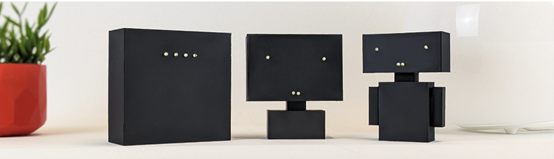
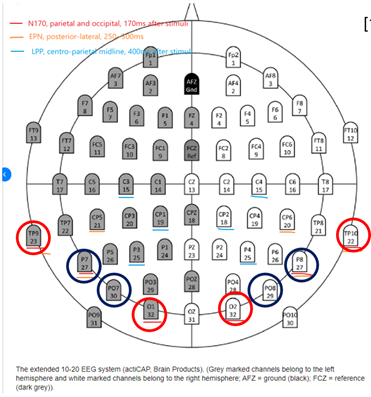
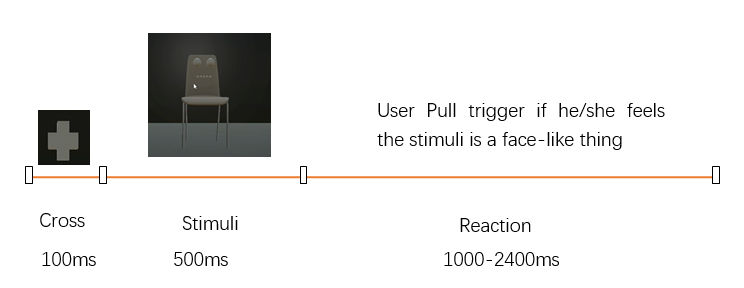
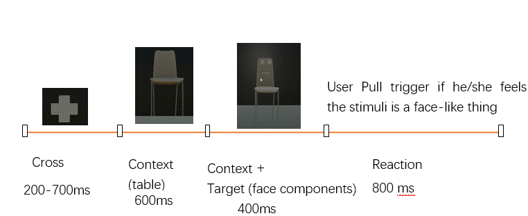
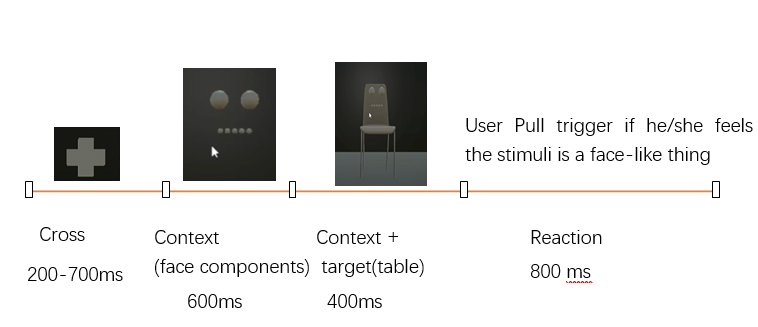
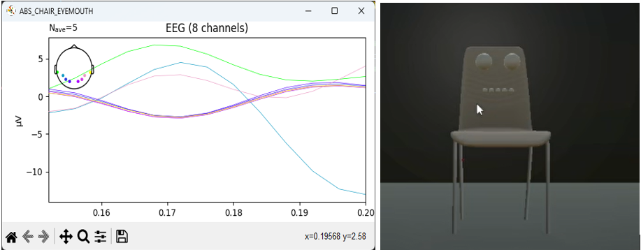
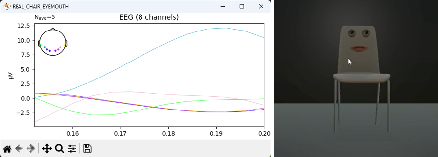
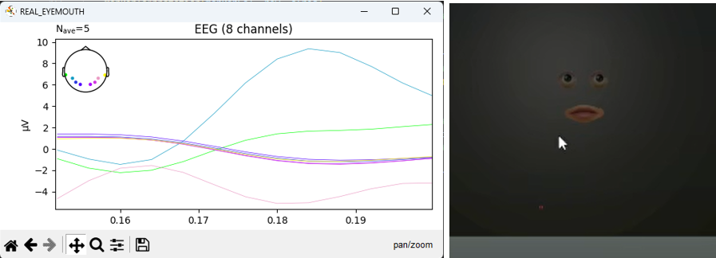

**This project investigates how varying degrees of facial anthropomorphism in virtual agents affect users’ brain responses and perceived social presence.**

<figure>
  
  <figcaption>Figure 1: Embodied Anthropomorphism of Personal Assistants [1].</figcaption>
</figure>

In this work, I designed an anthropomorphic virtual assistant by overlaying facial components—such as eyes and mouth—onto passive physical forms (e.g., cubes and chairs) using Augmented Reality (AR). The goal was to explore whether users cognitively and socially respond to these hybrid designs as they would to human-like agents.

To assess users’ neural responses, I used **EEG-based Event-Related Potentials (ERP)**, focusing particularly on the **N170 component**, which is known to be sensitive to face-like stimuli. Stimuli were presented in VR environments in structured paradigms to examine:
- Whether partial or abstract facial features on objects elicit N170.
- How combining facial features with non-human objects like cubes or chairs alters face perception.
- The competition effect between context (object) and face components on ERP signals.

<figure style="width: 50%; margin: auto;">
    
    <figcaption>Figure 2: The selected electrodes.</figcaption>
</figure>

**Key Methods and Tools**
- EEG recording with 8-channel Unicorn system using a modified 10–20 layout.
- ERP design based on established paradigms.
- Real-time VR and AR interaction with humanlike virtual agents.
- Social presence assessment using validated questionnaires.

Inspired by the experimental design in [2], where context like chair and face stimuli competition effect on N170 were studied, we also manipulated the context and face stimuli (see Figure 3).

<figure>
  

    

      
      <figcaption>(a) The system first shows randomized stimuli consists of single virtual head, single eye/mouth, cube, or combination of them. After presenting each stimulus, a cross will be shown at around the nose position.</figcaption>
    

    

      
      <figcaption>(b) Second, the system shows the stimulus in the order illustrated in this picture.</figcaption>
    

    

      
      <figcaption>(c) Finally, the system shows the stimulus in the order shown in this picture.</figcaption>
    

  

  <figcaption style="text-align: center; margin-top: 10px;">Figure 3: Stimulus design</figcaption>
</figure>

**Preliminary Results**
- N170 ERP signals were observed for abstract and realistic facial cues.
- Augmenting passive objects with humanlike facial features can delay or modulate N170 responses.
- Chairs with realistic face components triggered N170 around 190ms, suggesting delayed but notable face perception.

<figure>
  

    

      
      <figcaption>(a) Chair with abstract eyes and mouth (there is N170).</figcaption>
    

    

      
      <figcaption>(b) Chair with realistic eyes and mouth (N170 is delayed to around 190ms).</figcaption>
    

    

      
      <figcaption>(c) Realistic eyes and mouth (N170 is delayed to around 185ms).</figcaption>
    

  

  <figcaption style="text-align: center; margin-top: 10px;">Figure 3: Stimulus design</figcaption>
</figure>

This research aimed at understanding how **facial anthropomorphism in non-human agents**, especially when overlaid onto everyday objects, can influence **neurocognitive processing** and **social engagement** in mixed reality environments.

<iframe width="560" height="315" src="https://www.youtube.com/embed/3iSWSW032Kg" frameborder="0" allow="accelerometer; autoplay; clipboard-write; encrypted-media; gyroscope; picture-in-picture" allowfullscreen></iframe>

[1] *Schneiders, Eike, Eleftherios Papachristos, and Niels van Berkel. "The effect of embodied anthropomorphism of personal assistants on user perceptions." In Proceedings of the 33rd Australian conference on human-computer interaction, pp. 231-241. 2021.*

[2] *Sadeh, Boaz, and Galit Yovel. "Why is the N170 enhanced for inverted faces? An ERP competition experiment." Neuroimage 53, no. 2 (2010): 782-789.*