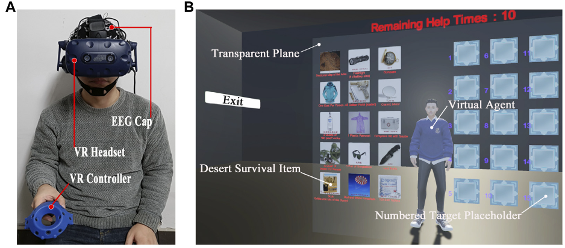

<figure>
  
  <figcaption>Figure 1: Experimental Setup and VR environment.</figcaption>
</figure>

Related research has shown that collaborating with Intelligent Virtual Agents (IVAs) embodied in Augmented Reality (AR) or Virtual Reality (VR) can improve task performance and reduce task load. Human cognition and behaviors are controlled by brain activities, which can be captured and reflected by Electroencephalogram (EEG) signals. However, little research has been done to understand users’ cognition and behaviors using EEG while interacting with IVAs embodied in AR and VR environments. In this paper, we investigate the impact of the virtual agent’s multimodal communication in VR on users’ EEG signals as measured by alpha band power. We develop a desert survival game where the participants make decisions collaboratively with the virtual agent in VR. We evaluate three different communication methods based on a within-subject pilot study: 1) a Voice-only Agent, 2) an Embodied Agent with speech and gaze, and 3) a Gestural Agent with a gesture pointing at the object while talking about it. No significant difference was found in the EEG alpha band power. However, the alpha band ERD/ERS calculated around the moment when the virtual agent started speaking indicated providing a virtual body for the sudden speech could avoid the abrupt attentional demand when the agent started speaking. Moreover, a sudden gesture coupled with the speech induced more attentional demands, even though the speech was matched with the virtual body. This work is the first to explore the impact of IVAs’ interaction methods in VR on users’ brain activity, and our findings contribute to the IVAs interaction design.