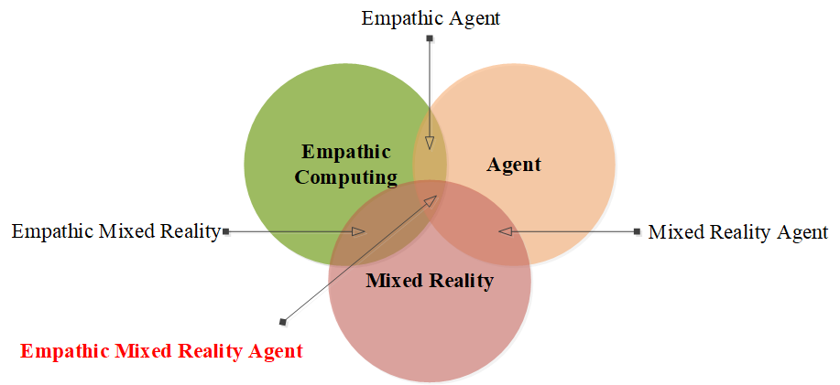

<figure>
  
  <figcaption>Figure 1: Empathic Mixed Reality Agent is the intersection of Empathic Mixed Reality, Empathic Agent and Mixed Reality Agent</figcaption>
</figure>

In recent years, there has been a growing body of research at the intersection of Mixed Reality (MR), Empathic Computing (EC), and agent technologies. Despite this trend, a unified theoretical framework to guide such research remains elusive. This paper introduces the concept of Empathic Mixed Reality Agents (EMiRAs), emerging from the convergence of Empathic Agent (EA), Mixed Reality Agent (MiRA), and Empathic Mixed Reality (EMR). We present the Corporeal Presence and Interactive Capacity (CPIC) matrix as a tool for examining EMiRAs-related studies, enabling systematic exploration of agents’ embodiment and environmental interaction capabilities. By conducting literature reviews organized within the CPIC matrix, we investigate the current landscape of EMiRAs research. Additionally, we discuss the challenges and opportunities inherent in developing EMiRAs. This work contributes to laying the groundwork for future advancements in the field by providing a comprehensive framework and analysis of EMiRAs-related research endeavors.

<iframe width="560" height="315" src="https://www.youtube.com/embed/sJyfr13DTJM" frameborder="0" allow="accelerometer; autoplay; clipboard-write; encrypted-media; gyroscope; picture-in-picture" allowfullscreen></iframe>

