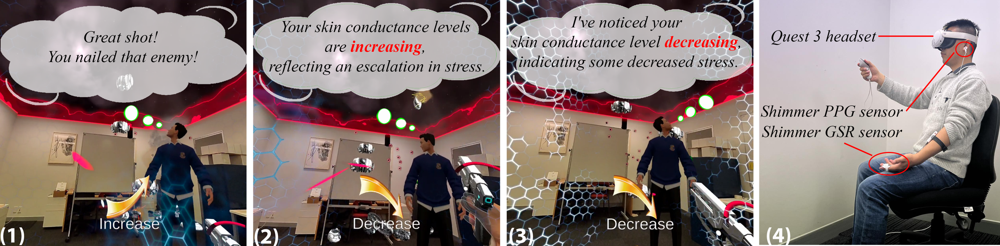

<figure>
  
  <figcaption>Figure 1: the empathic agent conditions in the experiment: (1) No Awareness Agent (NAA): The agent randomly praises
users’ shooting ignoring users’ Skin Conductance Level (SCL) changes. (2) Random Awareness Agent (RAA): The agent will
randomly comment on users’ SCL changes. (3) Accurate Awareness Agent (AAA): The agent will provide accurate comments
on the users’ SCL changes whenever the arrow is displayed. The arrow in each picture lets users know the changes in their SCL.
(4) The study setup: A participant wearing the Meta Quest 3 and Shimmer sensors.</figcaption>
</figure>

In human-agent interaction, establishing trust and a social bond with the agent is crucial to improving communication quality and performance in collaborative tasks. This paper investigates how a Mixed Reality Agent’s (MiRA) ability to acknowledge a user’s physiological state affects perceptions such as empathy, social connectedness, presence, and trust. In a within-subject study with 24 subjects, we varied the companion agent’s awareness during a mixed-reality first-person shooting game. Three agents provided feedback based on the users’ physiological states: (1) No Awareness Agent (NAA), which did not acknowledge the user’s physiological state; (2) Random Awareness Agent (RAA), offering feedback with varying accuracy; and (3) Accurate Awareness Agent (AAA), which provided consistently accurate feedback. Subjects reported higher scores on perceived empathy, social connectedness, presence, and trust with AAA compared to RAA and NAA. Interestingly, despite exceeding NAA in perception scores, RAA was the least favored as a companion. The findings and implications for the design of MiRA interfaces are discussed, along with the limitations of the study and directions for future work.

<iframe width="560" height="315" src="https://www.youtube.com/embed/fOIBo-shNs4" frameborder="0" allow="accelerometer; autoplay; clipboard-write; encrypted-media; gyroscope; picture-in-picture" allowfullscreen></iframe>