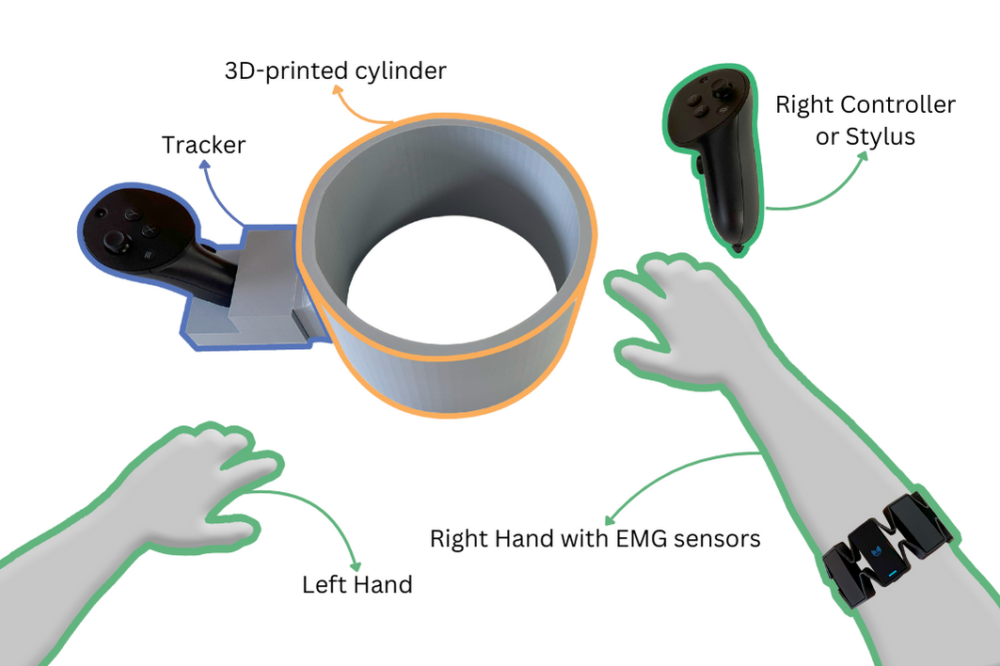
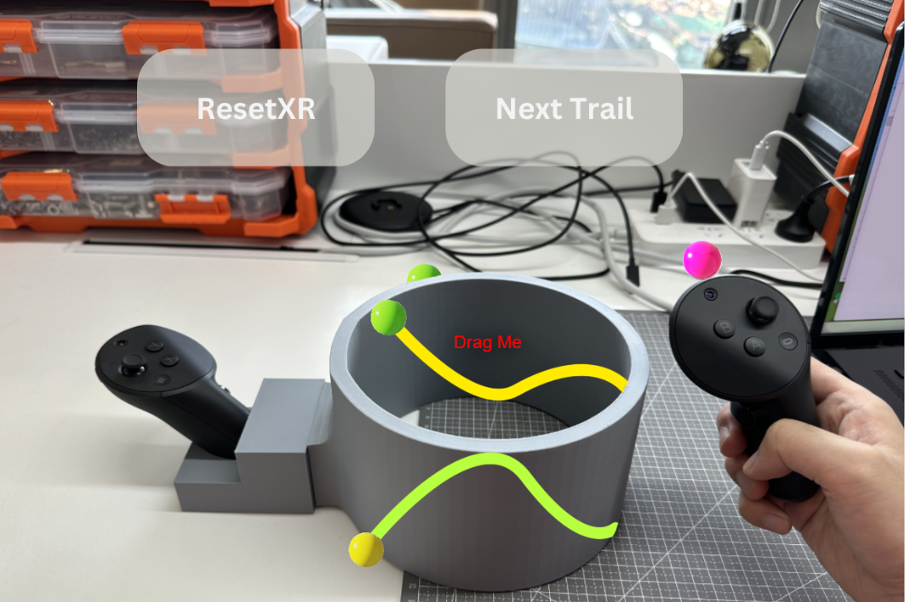
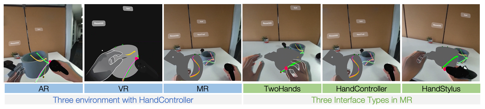

<figure>
  

    

      
      <figcaption style="text-align: center;">Figure 1: System Setup.</figcaption>
    

    

      
      <figcaption style="text-align: center;">Figure 2: User’s perspective.</figcaption>
    

  

</figure>

In this research, we investigate the effectiveness of asymmetric interactions (HandStylus, HandController, and TwoHands) in Augmented Reality (AR), Virtual Reality (VR), and Extended Reality (XR) for 3D digital drawing overlaying on physical and virtual objects. We evaluate the input accuracy and fatigue of these object-based 3D drawing experiences using quantitative measurements and further explore the correlation between these outcomes with subjective questionnaires. We found significant independence between environments and interface types, which considerably influence the performance and usability of 3D immersive drawing. We noted discrepancies between users’ subjective experiences and objective performance. Specifically, although AR drawing on physical objects provides superior accuracy and minimal muscle fatigue due to tangible feedback, and the TwoHands interaction offers the highest precision, the subjective results show the reverse outcome. Based on these findings, we propose design recommendations and discuss directions for future research in immersive drawing environments.

<figure>
  
  <figcaption>Figure 3: Experimental Conditions.</figcaption>
</figure>